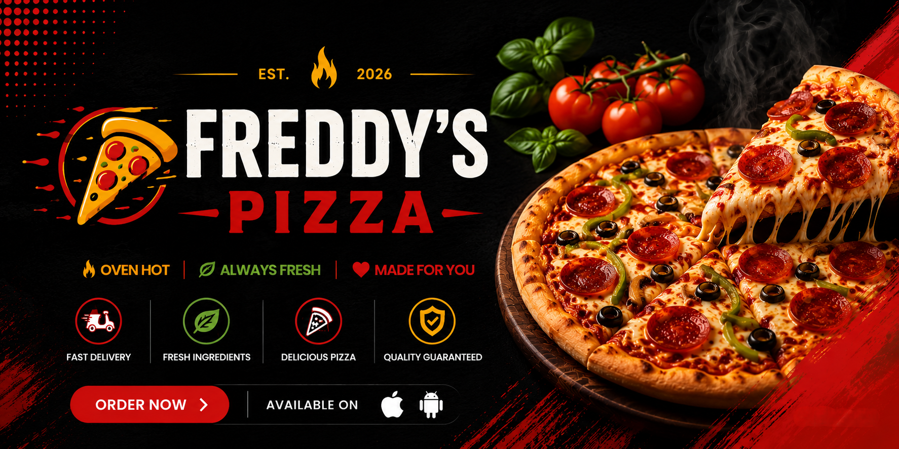

# 🍕 Freddy's Pizza – Modern Pizza Delivery, Simplified

<table>
  <tr>
    <td width="40%">
      
    </td>
    <td width="60%">
      Welcome to <strong>Freddy's Pizza</strong> — a modern full-stack mobile food ordering application built using <strong>React Native</strong>, <strong>Expo</strong>, <strong>Clerk Authentication</strong>, and <strong>Convex</strong>. This project showcases modern mobile application development practices, real-time backend integration, authentication workflows, and AI-assisted software engineering techniques.
    </td>
  </tr>
</table>

---

## 🔍 Features

- 🍕 **Interactive Pizza Menu** — Browse available pizzas, deals, and featured items.
- 🛒 **Shopping Cart System** — Add, remove, and manage orders seamlessly.
- 🔐 **Secure Authentication** — User registration and login powered by Clerk.
- ⚡ **Real-Time Backend** — Instant data synchronization using Convex.
- 📱 **Mobile-First Experience** — Designed specifically for mobile users.
- 🧑‍💼 **Admin Dashboard** — Manage products, orders, and application data.
- 🤖 **AI-Assisted Development** — Built using modern AI development workflows with Cursor.
- 🎯 **Scalable Architecture** — Structured for future expansion and production-ready features.

---

## 📂 Project Structure

```text
freddys-pizza/
│
├── .claude/            # AI workflow configuration and project instructions
├── .expo/              # Expo development environment files
├── .vscode/            # VS Code workspace settings
├── assets/             # Images, icons, fonts, and static resources
├── node_modules/       # Installed project dependencies
├── scripts/            # Development and automation scripts
├── src/                # Application source code
│
├── .gitignore          # Git ignore rules
├── AGENTS.md           # AI agent project instructions
├── app.json            # Expo application configuration
├── CLAUDE.md           # Claude AI project context
├── expo-env.d.ts       # Expo TypeScript environment definitions
├── package-lock.json   # Dependency lock file
├── package.json        # Project dependencies and scripts
├── README.md           # Project documentation
└── tsconfig.json       # TypeScript configuration
```

---

## 🌐 Project Goals

This project is being developed to gain hands-on experience with:

- Full-Stack Mobile Development
- React Native & Expo Ecosystem
- Authentication Systems
- Real-Time Backend Services
- Modern Software Architecture
- AI-Assisted Development Workflows
- Professional Git & GitHub Practices

---

## 📸 Screenshots

> Screenshots will be added as development progresses.

- Home Screen
- Authentication Screens
- Pizza Menu
- Shopping Cart
- Checkout Flow
- Admin Dashboard

---

## 🛠️ Technologies Used

### Frontend

- React Native
- Expo SDK 55
- TypeScript

### Backend

- Convex

### Authentication

- Clerk

### Development Tools

- Cursor AI
- Git
- GitHub
- Visual Studio Code

---

## ⚙️ How to Run

### 🖥️ Run Locally

1. Clone the repository.

```bash
git clone https://github.com/chalitha-wickramasingha/freddys-pizza.git
```

2. Navigate to the project directory.

```bash
cd freddys-pizza
```

3. Install dependencies.

```bash
npm install
```

4. Start the development server.

```bash
npx expo start
```

5. Scan the QR code using Expo Go on your mobile device.

---

## 🚧 Project Status

Currently under active development.

Planned functionality includes:

- User Authentication
- Pizza Menu Management
- Cart & Checkout System
- Order Tracking
- Real-Time Updates
- Admin Management Portal
- Push Notifications
- Payment Integration

---

## 🎓 Learning Journey

This project is part of my personal software engineering portfolio and learning journey focused on:

- Mobile Application Development
- AI-Assisted Coding
- Modern Development Workflows
- Full-Stack Application Design
- Production-Oriented Project Structure

---

## 👨‍💻 Author

**Chalitha Wickramasinghe**

🔗 GitHub: https://github.com/chalitha-wickramasingha

🔗 LinkedIn: https://www.linkedin.com/in/chalitha-t-wickramasingha

---

> 🍕 Building modern mobile experiences, one slice at a time.
>
> Thank you for visiting Freddy's Pizza!
